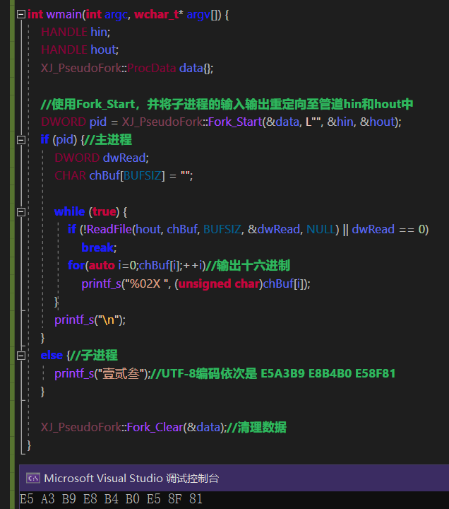

将常用的功能封装为一个个的函数，以便作为作为个人函数库进行使用。

- 函数放在项目``XJ_Functions``中；
- 项目``XJ_Test``用于测试``XJ_Functions``的函数；
- 项目``XJ_Functions``可以打包为dll，只不过嫌麻烦一般不这么做；
- 其他项目可以通过配置项目属性中的**配置属性 > VC++目录 > 包含目录**来引入``XJ_Cpp``，只不过需要在项目中额外使用一个cpp文件并通过``#include<XJ_XXX.cpp>``的方式引入并编译``XJ_Cpp``中的源码，详见项目``XJ_Test``的用法；
- 项目``XJ_Functions``中的源码均是UTF-8编码；

 
 

这里拿出``XJ_Functions``中的几个比较有用的内容：

#### ``XJ_PseudoFork``：

伪fork，行为参考了Linux的fork函数，本质是利用子进程创建手段以实现fork效果。
使用这个伪fork就能在一个项目中进行多个进程的测试(一般用于测试进程间相互通信)，项目的管理变得更加的轻松。
再强调一点，这不是真fork，因为子进程会从头执行代码而不是像fork那样将父进程进行拷贝。

#### ``XJ_String``：

将``WideCharToMultiByte``和``MultiByteToWideChar``进行简单的封装罢了。

- ``ConvertToA``：W字符串``wchar_t*``转换为A字符串``char*``；
- ``ConvertToW``：A字符串``char*``转换为W字符串``wchar_t*``；
- ``ConvertStr``：将A字符串``char*``进行编码转换，获得另一个代码页/字符集下的A字符串；

